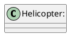

# Design Patterns

## Change-1: PlaneFactory

### Problem

Currently, there are many types of aircrafts like `Helicopter`, `PassengerPlane` and `PassengerDrone`.
All the current code is very tightly coupled with the current implementations of these aircrafts. 
If I want to add a new type of aircraft, I have to change the codebase at multiple places. Hence there is a problem.

### Solution

**Factory Pattern** is used to offload the creation of these aircrafts to `PlaneFactory` class, an interface called `IPlane` is created to ensure similar behaviour of the aircrafts.

### Before Refactoring

