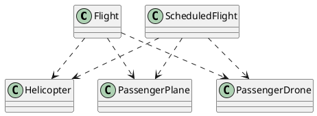
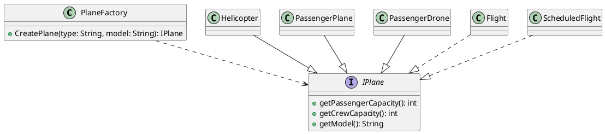
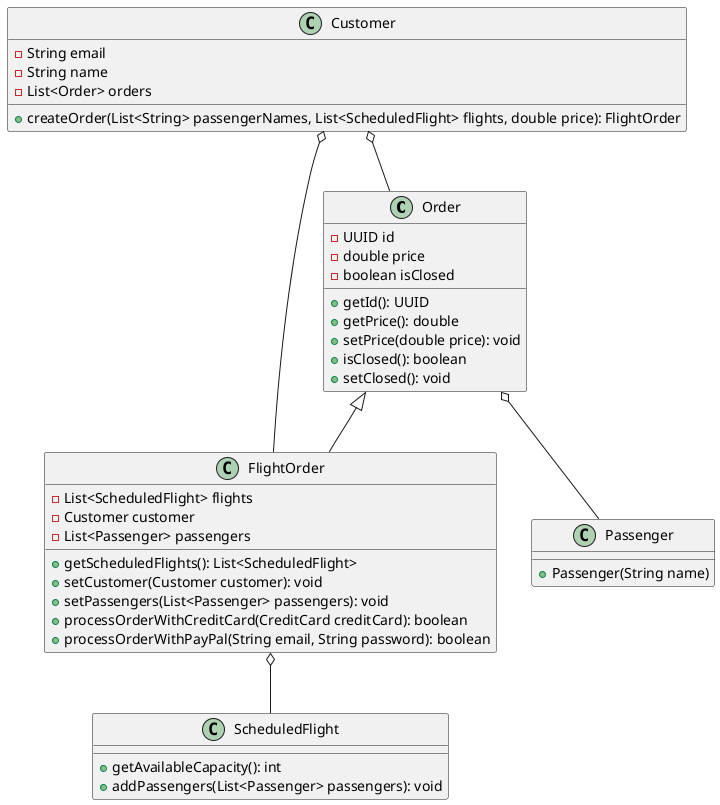
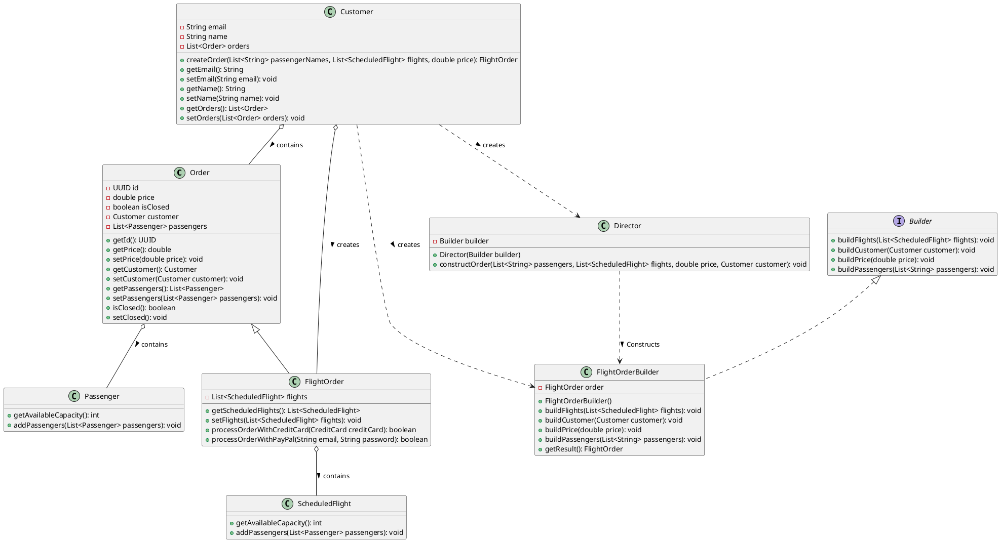

# Design Patterns

## Change-1: PlaneFactory

### Problem

Currently, there are many types of aircrafts like `Helicopter`, `PassengerPlane` and `PassengerDrone`.
All the current code is very tightly coupled with the current implementations of these aircrafts. 
If I want to add a new type of aircraft, I have to change the codebase at multiple places. Hence there is a problem.

### Solution

**Factory Pattern** is used to offload the creation of these aircrafts to `PlaneFactory` class, an interface called `IPlane` is created to ensure similar behaviour of the aircrafts.

### Before Refactoring


Here `Flight` and `ScheduledFilght` classes is tightly coupled with `Helicopter`, `PassengerPlane` and `PassengerDrone` classes.

```java
private boolean isAircraftValid(Airport airport) {
        return Arrays.stream(airport.getAllowedAircrafts()).anyMatch(x -> {
            String model;
            if (this.aircraft instanceof PassengerPlane) {
                model = ((PassengerPlane) this.aircraft).model;
            } else if (this.aircraft instanceof Helicopter) {
                model = ((Helicopter) this.aircraft).getModel();
            } else if (this.aircraft instanceof PassengerDrone) {
                model = "HypaHype";
            } else {
                throw new IllegalArgumentException(String.format("Aircraft is not recognized"));
            }
            return x.equals(model);
        });
    }
``` 
This is in the file `Flight.java`

### After Refactoring



Due to the introduction of `IPlane` interface, the coupling between classes like `Helicopter`, `PassengerPlane` and `PassengerDrone` is reduced.
Also, the factory makes the creation of the objects of these classes easy and extendible.


```Java

    private boolean isAircraftValid(Airport airport) {
        return Arrays.stream(airport.getAllowedAircrafts()).anyMatch(x -> {
            String model;
            if (!(this.aircraft instanceof IPlane)){
                throw new IllegalArgumentException(String.format("Aircraft is not recognized"));
            } else {
                model = ((IPlane) this.aircraft).getModel();
                return x.equals(model);
            }
        });
    }

```
Again in the file `Flight.java`.


Also new classes creation, declaration of methods in them, modification of `Runner.java` according to the new code is also done.


# Change-2 : FlightOrderBuilder

### Problem
The 'FlightOrder' class has multiple dependencies and attributes that need to be set during its construction. The constructor of 'FlightOrder' can become complex and difficult to manage, especially if the number of parameters increases.

### Solution

**Builder Pattern** is used to construct a complex object step by step. The 'FlightOrderBuilder' which implements 'Builder' Interface is created to build the 'FlightOrder' object. 'Director' class Constructs the 'FlightOrderBuilder' object and sets the attributes of 'FlightOrder' object using the 'FlightOrderBuilder' object.


### Before Refactoring



Here 'Customer' class creates 'Order' and 'FlightOrder' objects. 'FlightOrder' class has multiple dependencies like 'ScheduledFlight', 'Customer' and 'Passenger' objects. The 'createOrder' method in 'Customer' class is responsible for creating the 'FlightOrder' object and setting its attributes.

```Java
public FlightOrder createOrder(List<String> passengerNames, List<ScheduledFlight> flights, double price) {
        if (!isOrderValid(passengerNames, flights)) {
            throw new IllegalStateException("Order is not valid");
        }

        FlightOrder order = new FlightOrder(flights);
        order.setCustomer(this);
        order.setPrice(price);
        List<Passenger> passengers = passengerNames
                .stream()
                .map(Passenger::new)
                .collect(Collectors.toList());
        order.setPassengers(passengers);
        order.getScheduledFlights().forEach(scheduledFlight -> scheduledFlight.addPassengers(passengers));
        orders.add(order);
        return order;
    }
```
### After Refactoring



```Java
public FlightOrder createOrder(List<String> passengerNames, List<ScheduledFlight> flights, double price) {
        if (!isOrderValid(passengerNames, flights)) {
            throw new IllegalStateException("Order is not valid");
        }

        Builder builder = new FlightOrderBuilder();
        Director director = new Director(builder);
        director.constructOrder(passengerNames, flights, price, this);

        FlightOrder order = ((FlightOrderBuilder) builder).getResult();
  
        orders.add(order);
        return order;
    }
```

Here in 'Customer' class, the creation of flight order obeject is totally handled by 'FlightOrderBuilder' and 'Director' classes. The 'FlightOrderBuilder' class builds the 'FlightOrder' object step by step and 'Director' class constructs the 'FlightOrderBuilder' object and sets the attributes of 'FlightOrder' object using the 'FlightOrderBuilder' object.

# Change-3 : Strategy Pattern

## Refactoring Payment Processing with the Strategy Design Pattern


- ASSUMPTION - We haven't touched the tests and since tests call some methods directly which become useless after introducing strategy, we have kept those methods and called the centralised **(processOrder)** method in those primitive functions. Further implementations of payment strategy will be added without such methods.
## 1. Introduction
The original implementation of `FlightOrder` tightly coupled payment processing logic with the class itself. It contained separate methods for **credit card** and **PayPal** payments, making the system less flexible and harder to extend.

To improve **maintainability**, **scalability**, and **code reusability**, we introduced the **Strategy Pattern**, which allows different payment methods to be used interchangeably without modifying the `FlightOrder` class.

## 2. Key Changes

### A. Extracted Payment Logic into a Strategy Interface
We introduced a `PaymentStrategy` interface, which acts as a contract for different payment methods. Each payment method now implements this interface, ensuring all payments follow a common structure.

### B. Refactored Payment Methods
- Instead of separate `processOrderWithCreditCard()` and `processOrderWithPayPal()` methods, we now have a single `processOrder(PaymentStrategy paymentStrategy)`.
- The `FlightOrder` class no longer handles payment validation and transaction logic. It delegates these tasks to the respective **payment strategy**.
- This removes redundant logic and makes the class **more focused on order management** rather than payment processing.
### C. Encapsulated Payment Methods
- `CreditCard` and `PayPal` now implement `PaymentStrategy`.
- Each class handles its own validation and payment logic, making them more **self-contained**.
- If payment fails, it is now handled in a more centralized way.

---

## 3. Adding New Payment Methods
With the Strategy Pattern in place, adding a new payment method is **straightforward**.

### Steps to Add a New Payment Method (e.g., Google Pay)
1. **Create a New Class**
    - Implement the `PaymentStrategy` interface.
    - Add relevant fields like account details and validation logic.

2. **Implement the `pay(double amount)` Method**
    - Define the payment logic inside the method.
    - Ensure it returns `true` if the payment is successful.

3. **Use in FlightOrder**
    - Instantiate the new payment method in `processOrder(PaymentStrategy paymentStrategy)`.
    - Now `FlightOrder` can accept Google Pay without any modifications to its core logic.
    - This makes the system **extensible** and **maintainable**.
    - The new payment method can be easily integrated into the system.
   