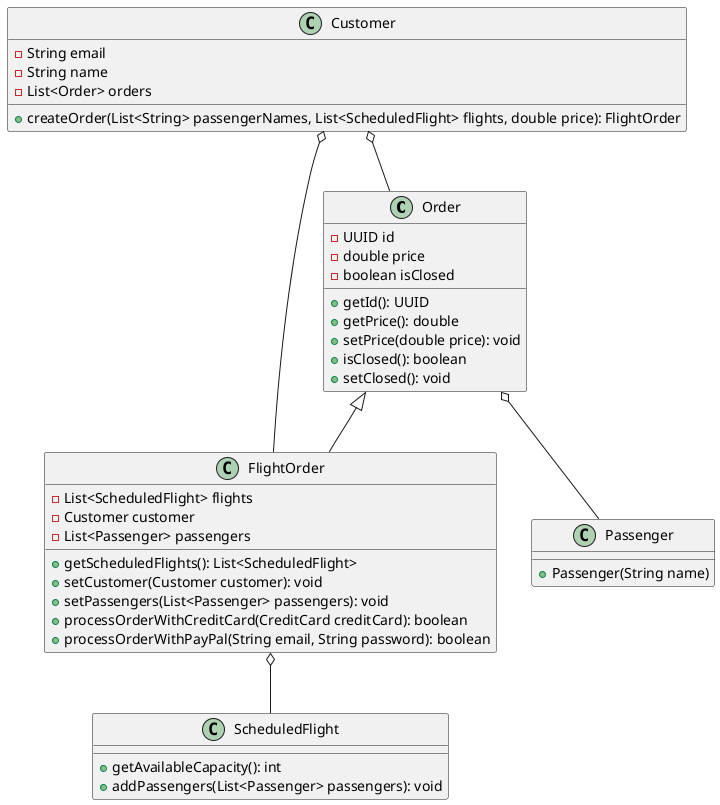
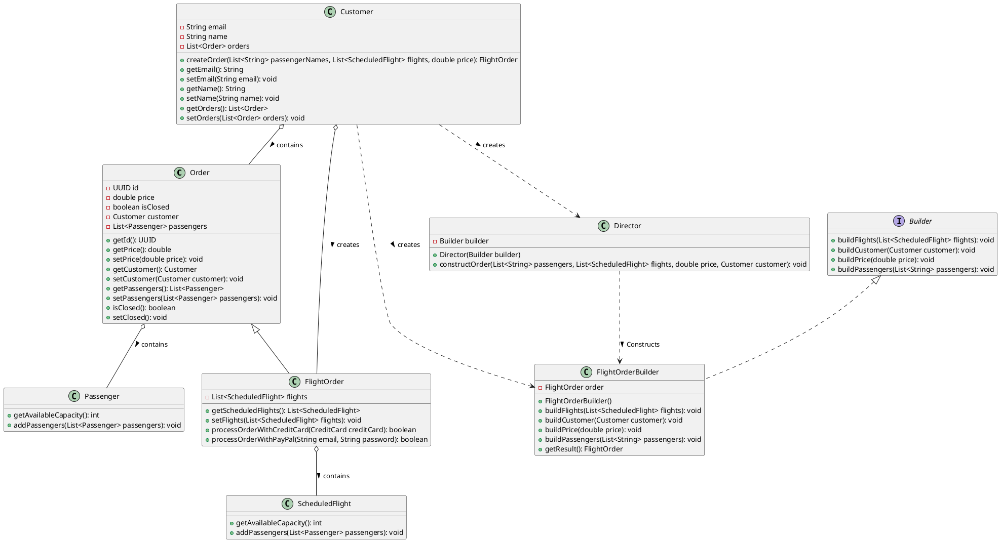

# Change-2 : FlightOrderBuilder

### Problem
The 'FlightOrder' class has multiple dependencies and attributes that need to be set during its construction. The constructor of 'FlightOrder' can become complex and difficult to manage, especially if the number of parameters increases.

### Solution

**Builder Pattern** is used to construct a complex object step by step. The 'FlightOrderBuilder' which implements 'Builder' Interface is created to build the 'FlightOrder' object. 'Director' class Constructs the 'FlightOrderBuilder' object and sets the attributes of 'FlightOrder' object using the 'FlightOrderBuilder' object.


### Before Refactoring



Here 'Customer' class creates 'Order' and 'FlightOrder' objects. 'FlightOrder' class has multiple dependencies like 'ScheduledFlight', 'Customer' and 'Passenger' objects. The 'createOrder' method in 'Customer' class is responsible for creating the 'FlightOrder' object and setting its attributes.

```Java
public FlightOrder createOrder(List<String> passengerNames, List<ScheduledFlight> flights, double price) {
        if (!isOrderValid(passengerNames, flights)) {
            throw new IllegalStateException("Order is not valid");
        }

        FlightOrder order = new FlightOrder(flights);
        order.setCustomer(this);
        order.setPrice(price);
        List<Passenger> passengers = passengerNames
                .stream()
                .map(Passenger::new)
                .collect(Collectors.toList());
        order.setPassengers(passengers);
        order.getScheduledFlights().forEach(scheduledFlight -> scheduledFlight.addPassengers(passengers));
        orders.add(order);
        return order;
    }
```
### After Refactoring



```Java
public FlightOrder createOrder(List<String> passengerNames, List<ScheduledFlight> flights, double price) {
        if (!isOrderValid(passengerNames, flights)) {
            throw new IllegalStateException("Order is not valid");
        }

        Builder builder = new FlightOrderBuilder();
        Director director = new Director(builder);
        director.constructOrder(passengerNames, flights, price, this);

        FlightOrder order = ((FlightOrderBuilder) builder).getResult();
  
        orders.add(order);
        return order;
    }
```

Here in 'Customer' class, the creation of flight order obeject is totally handled by 'FlightOrderBuilder' and 'Director' classes. The 'FlightOrderBuilder' class builds the 'FlightOrder' object step by step and 'Director' class constructs the 'FlightOrderBuilder' object and sets the attributes of 'FlightOrder' object using the 'FlightOrderBuilder' object.