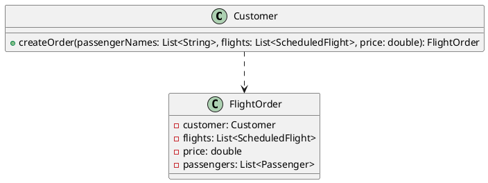
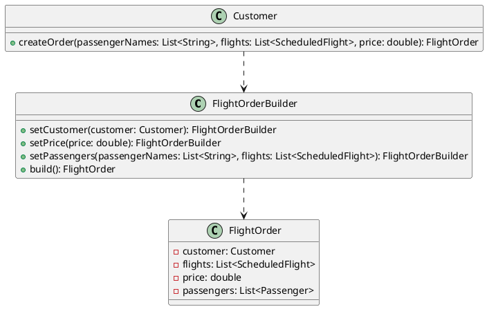

## **Change-3: Builder Pattern**

### **Problem**

Currently, the creation of `FlightOrder` objects involves multiple steps, including setting passengers, flights, prices, and validating the order. This process is tightly coupled with the `Customer` class, leading to several issues:
1. **Complexity**: The `createOrder` method in the `Customer` class has multiple responsibilities (validation, object creation, and state management), violating the **Single Responsibility Principle (SRP)**.
2. **Error-Prone**: If any step in the creation process is missed or incorrectly implemented, it can lead to invalid or incomplete `FlightOrder` objects.
3. **Inflexibility**: Adding new attributes or steps to the `FlightOrder` creation process requires modifying the `Customer` class, making the system less maintainable and extensible.

### **Solution**

The **Builder Pattern** is used to encapsulate the creation logic of `FlightOrder` objects into a dedicated `FlightOrderBuilder` class. This ensures that:
1. The creation process is modular and reusable.
2. Validation logic is integrated into the builder to ensure consistency.
3. The `Customer` class delegates the responsibility of creating `FlightOrder` objects to the builder, adhering to SRP.

### **Before Refactoring**

#### **UML Diagram**


#### **Code Example**
```java
public FlightOrder createOrder(List<String> passengerNames, List<ScheduledFlight> flights, double price) {
    if (!isOrderValid(passengerNames, flights)) {
        throw new IllegalStateException("Order is not valid");
    }

    FlightOrder order = new FlightOrder(flights);
    order.setCustomer(this);
    order.setPrice(price);

    List<Passenger> passengers = passengerNames.stream()
            .map(Passenger::new)
            .collect(Collectors.toList());
    order.setPassengers(passengers);

    flights.forEach(scheduledFlight -> scheduledFlight.addPassengers(passengers));
    orders.add(order);

    return order;
}
```

Here, the `Customer` class is responsible for:
1. Validating the order.
2. Creating the `FlightOrder` object.
3. Setting its attributes (customer, flights, price, passengers).
4. Managing side effects (e.g., adding passengers to flights).

This tight coupling makes the code harder to test, maintain, and extend.

---

### **After Refactoring**

#### **UML Diagram**


#### **Code Example**
```java
public class FlightOrderBuilder {
    private FlightOrder order;

    public FlightOrderBuilder(List<ScheduledFlight> flights) {
        this.order = new FlightOrder(flights);
    }

    public FlightOrderBuilder setCustomer(Customer customer) {
        order.setCustomer(customer);
        return this;
    }

    public FlightOrderBuilder setPrice(double price) {
        order.setPrice(price);
        return this;
    }

    public FlightOrderBuilder setPassengers(List<String> passengerNames, List<ScheduledFlight> flights) {
        // Validate the order before setting passengers
        if (!isOrderValid(passengerNames, flights)) {
            throw new IllegalStateException("Order is not valid");
        }

        List<Passenger> passengers = passengerNames.stream()
                .map(Passenger::new)
                .collect(Collectors.toList());
        order.setPassengers(passengers);

        // Add passengers to scheduled flights
        flights.forEach(scheduledFlight -> scheduledFlight.addPassengers(passengers));
        return this;
    }

    private boolean isOrderValid(List<String> passengerNames, List<ScheduledFlight> flights) {
        boolean valid = true;

        // Check if customer or passengers are on the no-fly list
        valid = valid && !FlightOrder.getNoFlyList().contains(order.getCustomer().getName());
        valid = valid && passengerNames.stream()
                .noneMatch(passenger -> FlightOrder.getNoFlyList().contains(passenger));

        // Check flight capacity
        valid = valid && flights.stream().allMatch(scheduledFlight -> {
            try {
                return scheduledFlight.getAvailableCapacity() >= passengerNames.size();
            } catch (NoSuchFieldException e) {
                e.printStackTrace();
                return false;
            }
        });

        return valid;
    }

    public FlightOrder build() {
        return order;
    }
}
```

#### **Updated `Customer.createOrder` Method**
```java
public FlightOrder createOrder(List<String> passengerNames, List<ScheduledFlight> flights, double price) {
    FlightOrder order = new FlightOrderBuilder(flights)
            .setCustomer(this)
            .setPrice(price)
            .setPassengers(passengerNames, flights) // Validation happens here
            .build();

    orders.add(order);
    return order;
}
```

---

### **Key Benefits of Refactoring**

1. **Separation of Concerns**:
   - The `Customer` class no longer handles the complex creation logic of `FlightOrder`. Instead, it delegates this responsibility to the `FlightOrderBuilder`.
   - The `FlightOrderBuilder` encapsulates all steps required to create a valid `FlightOrder`.

2. **Improved Readability**:
   - The `createOrder` method in the `Customer` class is now concise and focused on managing customer-related data.

3. **Enhanced Maintainability**:
   - Adding new attributes or steps to the `FlightOrder` creation process only requires modifying the `FlightOrderBuilder`, without affecting the `Customer` class.

4. **Validation Integration**:
   - The validation logic is integrated into the builder, ensuring that only valid `FlightOrder` objects are created.

5. **Testability**:
   - The `FlightOrderBuilder` can be tested independently of the `Customer` class, improving the overall test coverage.

---

### **Impact on Existing Code**

1. **Modified Classes**:
   - `Customer`: Updated the `createOrder` method to use the `FlightOrderBuilder`.
   - `FlightOrder`: No changes to the class itself, but its creation is now handled by the builder.

2. **New Classes**:
   - `FlightOrderBuilder`: Encapsulates the creation logic of `FlightOrder`.

3. **Improved Test Cases**:
   - Tests for `FlightOrder` creation can now focus on the `FlightOrderBuilder`, ensuring that the validation logic is thoroughly tested.

---

### **Conclusion**

By applying the **Builder Pattern**, the creation of `FlightOrder` objects has been decoupled from the `Customer` class, resulting in a more modular, maintainable, and extensible design. This change aligns with the principles of clean architecture and improves the overall quality of the codebase.