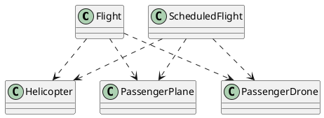
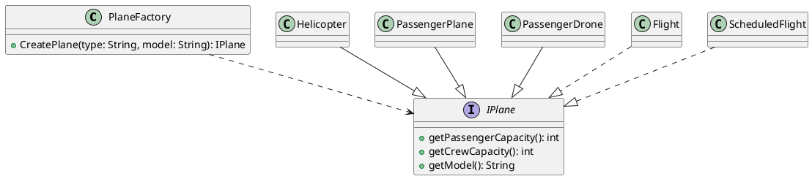

## Change-1: PlaneFactory

### Problem

Currently, there are many types of aircrafts like `Helicopter`, `PassengerPlane` and `PassengerDrone`.
All the current code is very tightly coupled with the current implementations of these aircrafts. 
If I want to add a new type of aircraft, I have to change the codebase at multiple places. Hence there is a problem.

### Solution

**Factory Pattern** is used to offload the creation of these aircrafts to `PlaneFactory` class, an interface called `IPlane` is created to ensure similar behaviour of the aircrafts.

### Before Refactoring


Here `Flight` and `ScheduledFilght` classes is tightly coupled with `Helicopter`, `PassengerPlane` and `PassengerDrone` classes.

```java
private boolean isAircraftValid(Airport airport) {
        return Arrays.stream(airport.getAllowedAircrafts()).anyMatch(x -> {
            String model;
            if (this.aircraft instanceof PassengerPlane) {
                model = ((PassengerPlane) this.aircraft).model;
            } else if (this.aircraft instanceof Helicopter) {
                model = ((Helicopter) this.aircraft).getModel();
            } else if (this.aircraft instanceof PassengerDrone) {
                model = "HypaHype";
            } else {
                throw new IllegalArgumentException(String.format("Aircraft is not recognized"));
            }
            return x.equals(model);
        });
    }
``` 
This is in the file `Flight.java`

### After Refactoring



Due to the introduction of `IPlane` interface, the coupling between classes like `Helicopter`, `PassengerPlane` and `PassengerDrone` is reduced.
Also, the factory makes the creation of the objects of these classes easy and extendible.


```Java

    private boolean isAircraftValid(Airport airport) {
        return Arrays.stream(airport.getAllowedAircrafts()).anyMatch(x -> {
            String model;
            if (!(this.aircraft instanceof IPlane)){
                throw new IllegalArgumentException(String.format("Aircraft is not recognized"));
            } else {
                model = ((IPlane) this.aircraft).getModel();
                return x.equals(model);
            }
        });
    }

```
Again in the file `Flight.java`.


Also new classes creation, declaration of methods in them, modification of `Runner.java` according to the new code is also done.

